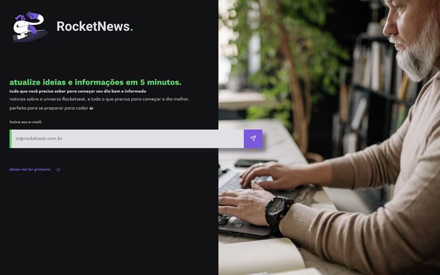

# Desafio: Rocketnews
Desafio criado pela Rocketseat para assinantes gratuitos do [site da Rocketseat](https://rocketseat.com.br).

## Sobre o desafio
Esse projeto é uma página para captação de leads ou newsletter. O objetivo é criar uma página responsiva e pronta para ser usada em qualquer projeto (apenas o front-end foi criado).

> Essa foi a página que eu criei: [Rocketnews](https://misterioso013.github.io/5-days-of-frontend/challenges/rocketnews/)

## Layout
O layout da aplicação está disponível no Figma: [Layout Web](https://www.figma.com/file/OVTHLjc2hi3MSQiYm9BplU/DD-%2F-RocketNews/duplicate)


## Tecnologias
- HTML
- CSS

## Style Guide

### Cores
```css
:root {
  --body-bg-color: #121214;
  --text-color: #E1E1E6;
  --title-color: #04D361;
  --form-color: #A8A8A8;
  --bg-button-color: #8257e5;
}
```

### Fontes

- [Spartan](https://fonts.google.com/specimen/League+Spartan)
- [Work Sans](https://fonts.google.com/specimen/Work+Sans)

```css
@import url('https://fonts.googleapis.com/css2?family=League+Spartan:wght@400;500;700&family=Work+Sans:wght@400;500;700&display=swap');

body {
  font-family: 'Work Sans', sans-serif;
}

h1, h2, h3, h4, h5, h6 {
  font-family: 'League Spartan', sans-serif;
}
```

